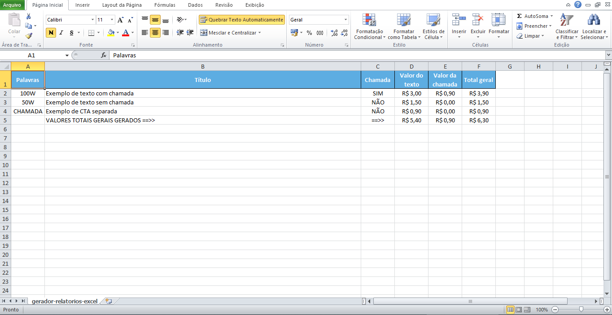

# GERADOR DE RELATÓRIOS PARA EXCEL

Criado para gerar relatórios mês a mês de forma independente de local, identificando textos e valores produzidos, gerando uma planilha excel para conferência posterior.

## DEFINIÇÕES E MÉTODO DE USO

Este projeto foi criado com intuíto de estudo e uso pessoal. Conforme tenho tempo redijo textos para plataformas proprietárias no modo freelancer. Ao longo do tempo se fez necessário a contagem e manutenção de textos produzidos juntamente com seus devidos pagamentos.

Criei este projeto para que cada mês pudesse analisar o que produzi de forma idependente e sem grande mudanças.

O projeto funciona da seguinte maneira:

1 - Copiar o arquivo executável encontrado na pasta `dist` para dentro do diretório onde se encontram os texto escritos no Microsoft Word (com extensão .docx), não importa a quantidade de arquivos que o diretório possui.

2 - Os textos a serem analisados devem iniciar com uma palavra da lista abaixo apra serem analisados conforme a quantidade de palavras proposta (o script não conta as palavras no texto, apenas lê a primeira letra do titulo do arquivo para definir quantas palavras foi proposta na tarefa e o valor daquela tarefa):

- 30W
- 50W
- 100W
- 500W
- 1000W
- 2000W
- CHAMADA

A escolha da quantidade e valor das palavras foi de uso pessoal, para implementar outros valores faça uso do código em main.py.

3 - A chamada é uma CTA que pode ter sido escrita separada ou dentro do arquivo do texto, para identificar e contabilizar a CTA ela deve ter a tag `CHAMADA:` que incluida no texto apenas uma vez, não há tratamento para mais de uma CTA no mesmo arquivo.

4 - Seguem exemplos de arquivos de textos para teste, o título do arquivo deve se parecer como: 500W titulo do texto aqui ou 30W Outro título de texto, lembrando que a extensão .docx não precisa estar escrita no titulo do texto mas o arquivo precisa ser docx para ser lido, ou seja é recomendável que outros arquivos .docx e que não se deseja analisar não estejam no diretório.

5 - Ao utilizar o executável ele irá abrir um console para acompanhar o processo, assim que terminar o processo o console fecha e fica disponível o arquivo .xlsx, que pode ser aberto no Microsoft Excel, com o mesmo nome da pasta onde foi utilizado o script.

Exemplo:

O diretório nomeado `JANEIRO 2022` contém os textos a serem analisados, copiar o arquivo .exe para dentro deste diretório e executá-lo, ao final do processo gera a planilha com os dados. Executar novamente o arquivo irá atualizar a planilha existente (caso a planilha não esteja em uso).

Exemplo de resultado obtido:

## Dependências e personalização

As dependências sequem no arquivo `requirements.txt`.
Para gerar um novo executável com as mudanças realizadas é preciso usar o `pyinstaller`, que ja consta no `requirements.txt`.
Com o ambiente virtual iniciado, digitar no terminal `pyinstaller --onefile --name mensal_report --icon=icon.ico main.py`.

## Considerações

Gostou do código? Mê de uma estrela. Serviu bem para você? Compartilhe.
